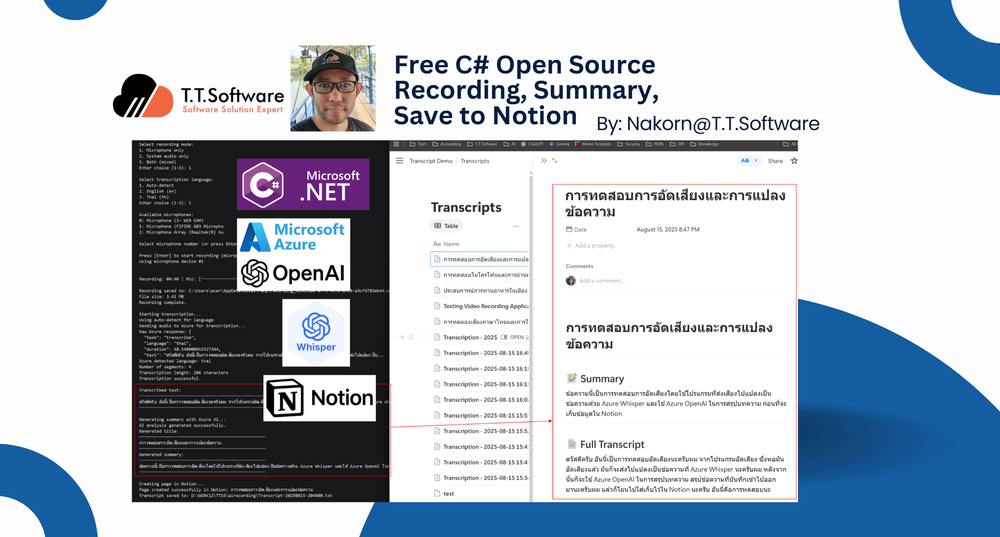
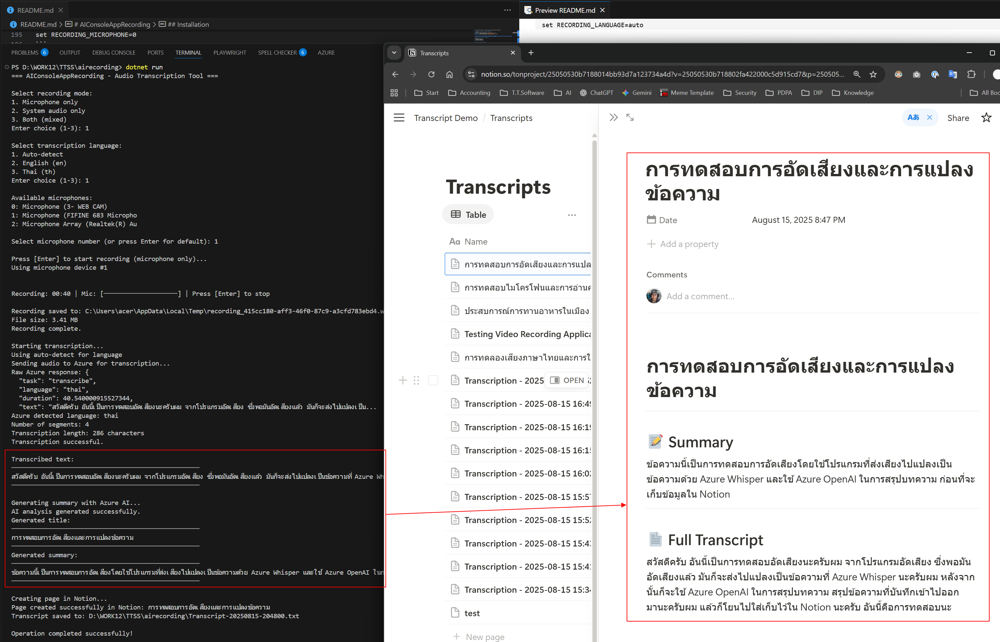
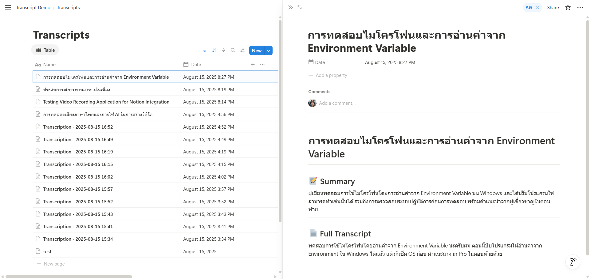
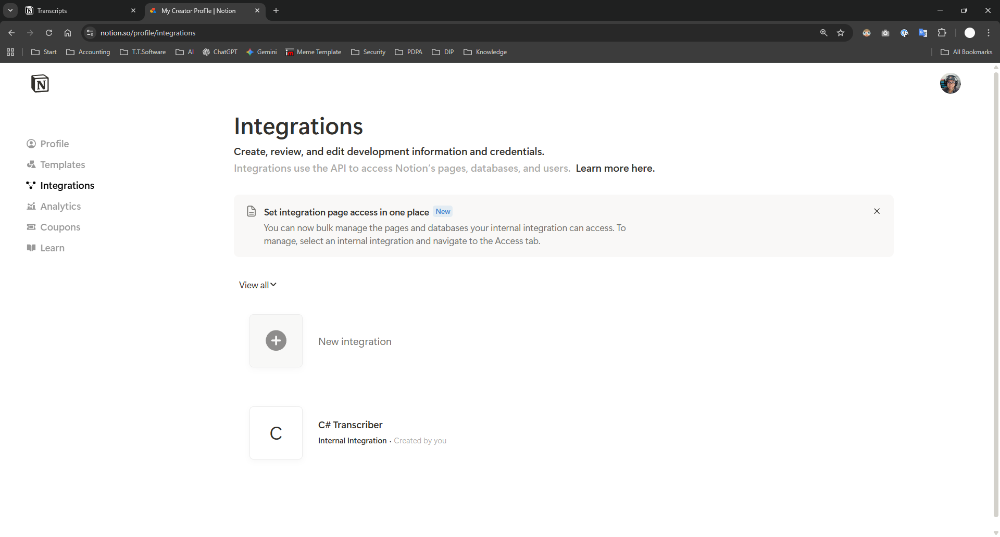
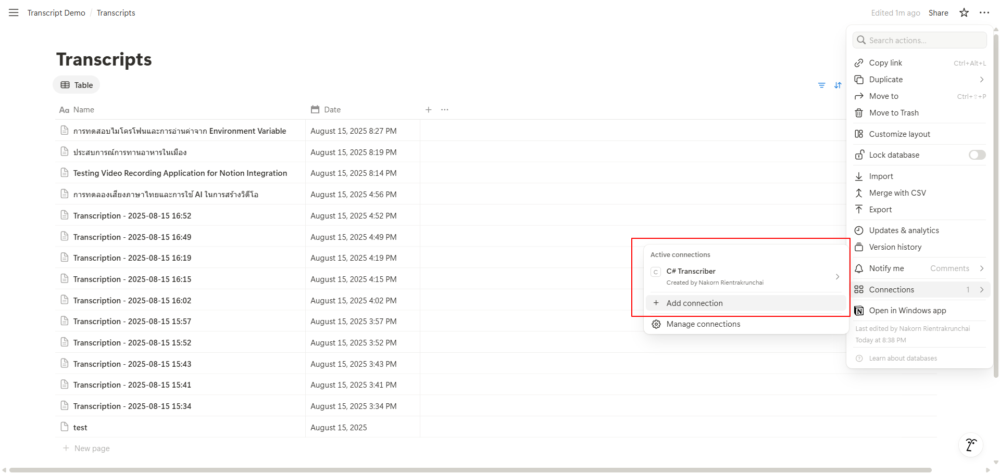
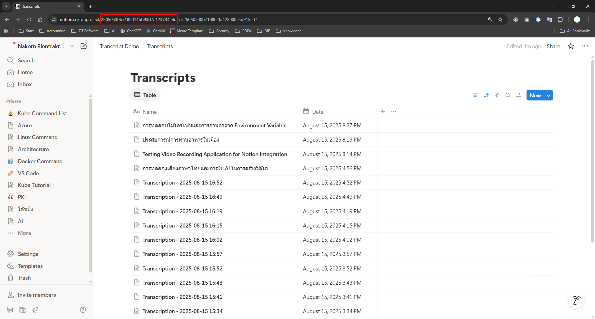

# AIConsoleAppRecording



A powerful .NET 8 console application for audio recording, transcription, and intelligent note-taking. Record audio from your microphone, system audio, or both simultaneously, then automatically transcribe it using Azure OpenAI Whisper, generate summaries, and save to Notion.

## Screenshots

<details>
<summary>📸 Click to view application screenshots</summary>

### Running the Application


### Result in Notion


</details>

## Features

- 🎙️ **Flexible Audio Recording**
  - Record from microphone only
  - Record system audio only
  - Record both sources mixed together
  - Real-time volume level indicators
  - Support for multiple microphone devices

- 🔤 **Automatic Transcription**
  - Powered by Azure OpenAI Whisper
  - Multi-language support (Auto-detect, English, Thai)
  - High accuracy transcription

- 📝 **AI-Powered Summarization** (Optional)
  - Generate concise summaries using Azure AI
  - Smart title generation for better organization

- 📚 **Notion Integration**
  - Automatically create pages in your Notion database
  - Structured content with title, date, and full transcript
  - Seamless workflow integration

- 💾 **Local Backup**
  - Save transcripts as timestamped text files
  - Includes both summary and full transcript

## Prerequisites

- .NET 8.0 SDK or later
- Azure OpenAI subscription with Whisper deployment
- Notion account with an integration token
- (Optional) Azure AI subscription for summarization

## Installation

1. Clone the repository:
```bash
git clone https://github.com/T-T-Software-Solution/airecording.git
cd airecording
```

2. Restore NuGet packages:
```bash
dotnet restore
```

3. Build the application:
```bash
dotnet build
```

## Configuration

### Required: Set User Secrets

The application uses secure user secrets for sensitive configuration. Set up the following:

```bash
# Initialize user secrets (first time only)
dotnet user-secrets init

# Azure Whisper Configuration (REQUIRED)
dotnet user-secrets set "Azure:EndpointUrl" "https://your-resource.openai.azure.com/openai/deployments/whisper/audio/transcriptions?api-version=2024-06-01"
dotnet user-secrets set "Azure:ApiKey" "your-azure-api-key"

# Notion Configuration (REQUIRED)
dotnet user-secrets set "Notion:ApiToken" "your-notion-integration-token"
dotnet user-secrets set "Notion:DatabaseId" "your-notion-database-id"

# Azure AI Configuration (OPTIONAL - for summarization)
dotnet user-secrets set "AzureAI:EndpointUrl" "https://your-resource.openai.azure.com/openai/deployments/gpt-4/chat/completions?api-version=2024-06-01"
dotnet user-secrets set "AzureAI:ApiKey" "your-azure-ai-api-key"
```

### Setting up Notion

1. Create a Notion integration:
   - Go to https://www.notion.so/my-integrations
   - Click "New integration"
   - Give it a name and select your workspace
   - Copy the integration token

   

2. Create a database in Notion:
   - Create a new database with at least two properties:
     - **Name** (Title property) - for the transcript title
     - **Date** (Date property) - for the recording timestamp
   - Share the database with your integration
   
   
   
   - Copy the database ID from the URL
   
   

### Optional: Environment Variables for Defaults

Skip the selection prompts by setting default values:

#### Windows

**Using Command Prompt (CMD):**
```cmd
setx RECORDING_MODE "both"
setx RECORDING_LANGUAGE "auto"
setx RECORDING_MICROPHONE "0"
```

**Using PowerShell:**
```powershell
[Environment]::SetEnvironmentVariable('RECORDING_MODE', 'both', 'User')
[Environment]::SetEnvironmentVariable('RECORDING_LANGUAGE', 'auto', 'User')
[Environment]::SetEnvironmentVariable('RECORDING_MICROPHONE', '0', 'User')
```

#### Linux/macOS

**For current session:**
```bash
export RECORDING_MODE="both"
export RECORDING_LANGUAGE="auto"
export RECORDING_MICROPHONE="0"
```

**Make permanent (add to ~/.bashrc or ~/.zshrc):**
```bash
echo 'export RECORDING_MODE="both"' >> ~/.bashrc
echo 'export RECORDING_LANGUAGE="auto"' >> ~/.bashrc
echo 'export RECORDING_MICROPHONE="0"' >> ~/.bashrc
```

#### Valid Values

- **RECORDING_MODE**: `mic`, `system`, `both`
- **RECORDING_LANGUAGE**: `auto`, `en`, `th`
- **RECORDING_MICROPHONE**: Device number (0, 1, 2, etc.)

## Usage

1. Run the application:
```bash
dotnet run
```

2. If environment variables are not set, you'll be prompted to select:
   - Recording mode (microphone/system/both)
   - Transcription language
   - Microphone device (if applicable)

3. Press Enter to start recording

4. Speak or play audio

5. Press Enter again to stop recording

6. The application will:
   - Transcribe the audio
   - Generate a summary (if configured)
   - Create a Notion page
   - Save locally as a text file
   - Clean up temporary files

### Example Output


## Output

### Notion Page
- **Title**: "Transcription - YYYY-MM-DD HH:MM" or AI-generated title
- **Date**: Recording timestamp
- **Content**: Summary (if available) and full transcript


### Local File
- **Filename**: `Transcript-YYYYMMDD-HHMMSS.txt`
- **Contents**:
  - Recording timestamp
  - Summary (if available)
  - Full transcript

## Troubleshooting

### Environment Variables Not Working

If the app still prompts for settings despite having environment variables set:

1. **Check if variables are persisted (Windows):**
```powershell
[Environment]::GetEnvironmentVariable('RECORDING_MODE', 'User')
[Environment]::GetEnvironmentVariable('RECORDING_LANGUAGE', 'User')
[Environment]::GetEnvironmentVariable('RECORDING_MICROPHONE', 'User')
```

2. **Restart your terminal** after setting variables with `setx`

3. **For current session only (Windows):**
```cmd
set RECORDING_MODE=both
set RECORDING_LANGUAGE=auto
set RECORDING_MICROPHONE=0
```

### Removing Environment Variables

**Windows (PowerShell):**
```powershell
[Environment]::SetEnvironmentVariable('RECORDING_MODE', $null, 'User')
[Environment]::SetEnvironmentVariable('RECORDING_LANGUAGE', $null, 'User')
[Environment]::SetEnvironmentVariable('RECORDING_MICROPHONE', $null, 'User')
```

**Linux/macOS:**
```bash
unset RECORDING_MODE
unset RECORDING_LANGUAGE
unset RECORDING_MICROPHONE
```

### Audio Recording Issues

- **No audio devices found**: Ensure your microphone is connected and recognized by Windows
- **System audio not recording**: Some systems require specific audio drivers or permissions
- **Low volume**: Check your system audio settings and microphone levels

### API Errors

- **Azure Whisper**: Verify your endpoint URL includes the full path with API version
- **Notion**: Ensure your integration has access to the database
- **Rate limits**: Add delays between requests if hitting rate limits

## Project Structure

```
airecording/
├── Program.cs              # Main application entry point
├── AudioService.cs         # Audio recording logic using NAudio
├── AzureWhisperService.cs  # Azure OpenAI Whisper integration
├── AzureSummaryService.cs  # Azure AI summarization service
├── NotionService.cs        # Notion API integration
├── RecordingSettings.cs   # Settings and environment management
├── AIConsoleAppRecording.csproj  # Project file
└── README.md              # This file
```

## Dependencies

- **NAudio** - Audio recording and processing
- **Microsoft.Extensions.Configuration** - Configuration management
- **Microsoft.Extensions.Configuration.Json** - JSON configuration support
- **Microsoft.Extensions.Configuration.UserSecrets** - Secure secrets storage
- **System.Text.Json** - JSON serialization

## Security

- All API keys and tokens are stored securely using .NET user secrets
- Never commit secrets to version control
- Use environment variables for non-sensitive defaults only

## License

This project is provided as-is for educational and personal use.

## Contributing

Contributions are welcome! Please feel free to submit pull requests or open issues for bugs and feature requests.

## Support

For issues or questions, please open an issue on the GitHub repository.